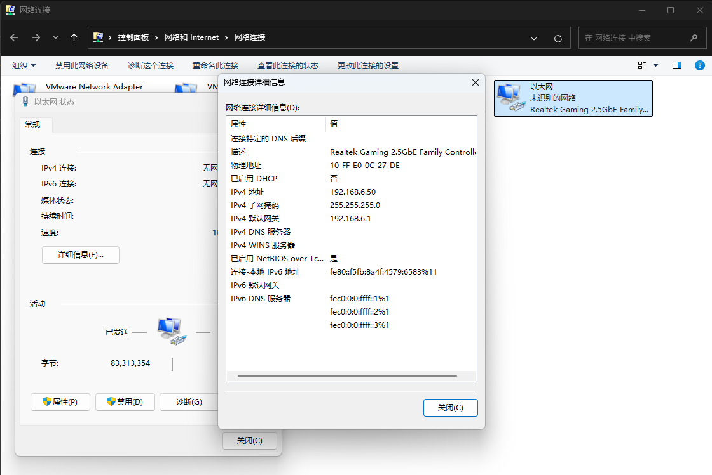
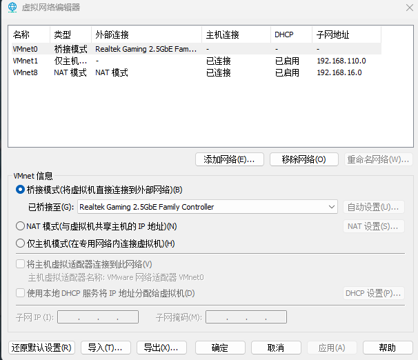
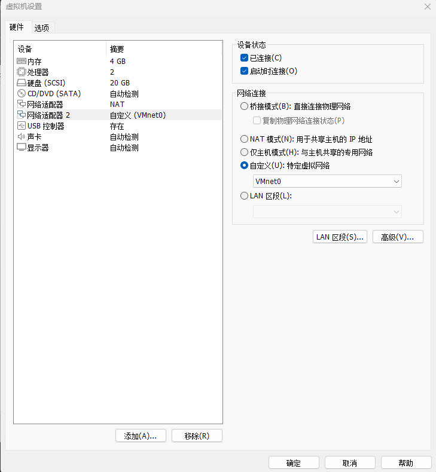
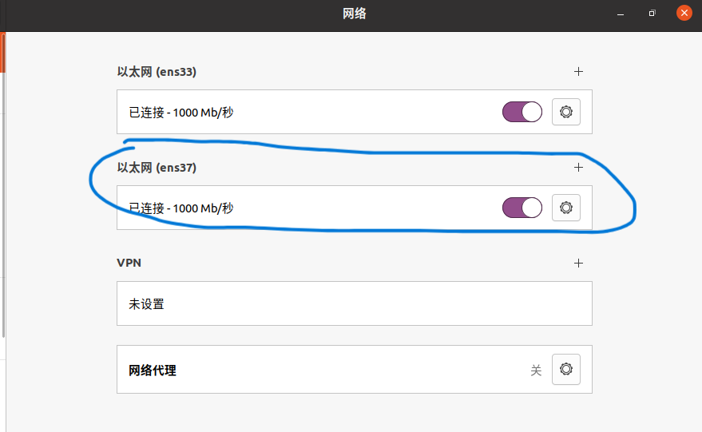
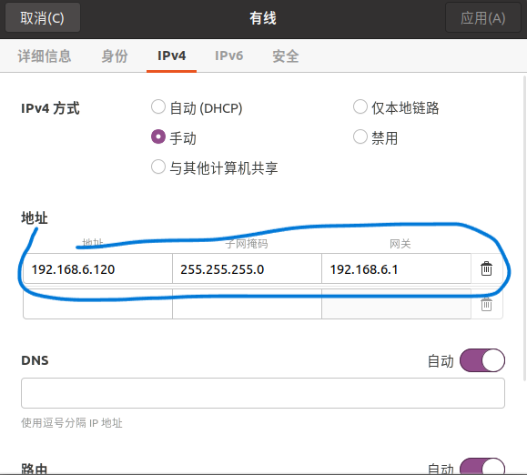

# 将linux主板通过网口连接到虚拟机ubuntu中


1.linux主板在uboot中配置好本机的ipv4地址，例如192.168.6.50。

```
setenv ipaddr 192.168.6.50 
setenv gatewayip 192.168.6.1 
setenv netmask 255.255.255.0 
setenv serverip 192.168.6.120 
saveenv
```

2.通过网线将linux主板和win11电脑连接起来，在控制面板的网络中查看识别到的网口，并将网口的ip地址改为192.168.6.50。



3.打开虚拟机的虚拟网络编辑器，点击更改设置，在VMnet0的外部连接改为桥接模式，并选择网口为linux主板网口



4.打开虚拟机的设置，添加一个网络适配器2，模式改为自定义，选择网络为VMnet0.



5.打开ubuntu主机，由于VMnet0是第二个配置的，因此打开右上角第二个网络的设置，将网络的ip设置为例如192.168.6.120（要求linux主机和ubuntu在同一网段），应用之后保存。





6.ubuntu打开终端，ping一下linux主机（ping 192.168.6.50）,连接正常。

7.linux在uboot或者在文件系统中打开终端，ping一下ubuntu（ping 192.168.6.120）,连接正常，代表网络已互通。